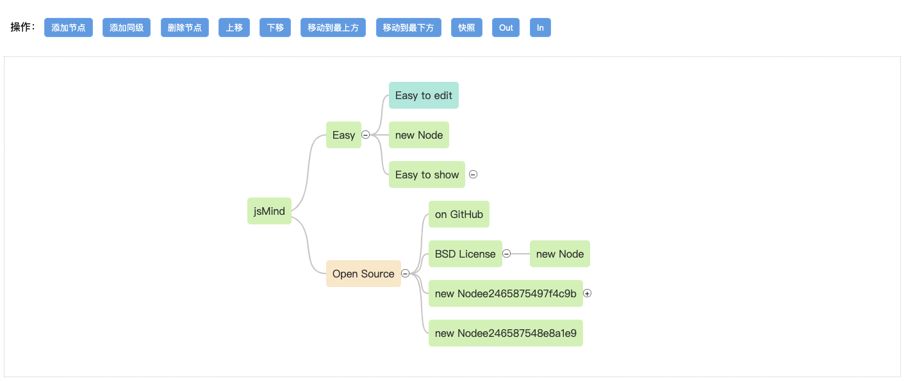

<!--
 * @Descripttion: 
 * @version: 
 * @Author: zhenzipu
 * @Date: 2021-07-15 15:05:39
 * @LastEditors: zhenzipu
 * @LastEditTime: 2022-01-04 17:09:59
-->
# hc-mind

> 一个 Vue 组件 ( 基于 [jsmind](https://github.com/hizzgdev/jsmind ) )二次开发新增异步加载子节点、动态节点样式、
动态节点提示框、动态菜单、拖拽回调、整图拖拽等常用功能


# 安装
```bash
yarn add hc-mind # or npm install hc-mind
```

# 快速开始
```js
import jm from 'hc-mind';
Vue.use(jm);

if (window.jsMind) {
  console.log('hc-mind start...');
  Vue.prototype.jsMind = window.jsMind;
}
```

# 使用
```html
<js-mind :values="mind" :options="options" ref="jsMind" height="500px"></js-mind>
```

## 参数
- 是否异步加载子节点
```js
asyncNext:true // false
/**
 * 请求下一层节点数据
 * node 当前节点
 * return 当前及子节点
 * nextLevelFn 返回promise模拟接口返回效果
 * 返回结构为
    {
        nodeid:node.id,
        topic:node.topic,
        child:[]
    }
    child为当前节点子节点 hasNextNode【是否有子节点】
 */
nextLevelFn: function (node) {
  return new Promise(function(resolve, reject) {
    setTimeout(() => {
      let newNode={
        nodeid:node.id,
        topic:node.topic,
        child:[]
      }
      for (let index = 0; index < 2; index++) {
          var nodeid = jsMind.util.uuid.newid();
          var topic = "new Node";
          var data={
              hasNextNode:false
          }
          if (index%2 ==0) {
              data.hasNextNode=true
          }else{
              data.hasNextNode=false
          }
          newNode.child.push(
            {
              nodeid:nodeid,
              topic:topic+nodeid,
              data:data
            }
          )
      }
      resolve(newNode);
    }, 1000);
  });
},

```
- 动态设置节点样式

```js
/**
 * 根据节点某字段设置类名
 * node 当前节点
 * classRes 处理类名
 */
classFn: function(node) {
  let { quote, bindData, bindProduct } = node.data;
  let classRes = "";
  /**
   * quote        0 非引用    1 引用
   */
  if (quote) {
      classRes += " quote";
  } else {
      classRes += " node";
  }
  return classRes;
}
```
- 动态设置节点提示框

```js

/**
 * tooltip
 * node 当前节点
 * 返回提示框信息数组
 */
 
tooltipFn: function(node) {
  if (node.isroot) {
    return [
      {
        label: "根节点名称",
        value: node.topic
      }
    ];
  } else {
    return [
      {
        label: "节点名称",
        value: node.topic
      },
      {
        label: "节点ID",
        value: node.id
      }
    ];
  }
}

```
- 拖拽节点回调

```js
/**
 * 拖拽回调函数
 * src 操作节点
 * target 拖拽至目标节点
 */
dragFn: function(src, target) {
  return new Promise(function(resolve, reject) {
    setTimeout(() => {
      resolve(1); // 返回为true即放行 反之失败
    }, 1000);
  });
}

```
- 菜单

```js
  /**
   * 重新初始化菜单
   * node 操作节点
   */
  initMenu: function(node) {
    if (!node) {
      return [];
    }
    if (node.isroot) {
      _this.options.menuOpts.injectionList = [ {
          target: "indexDetail",
          text: "查看信息",
          callback: function(node) {
            console.log("查看信息:", node);
            alert(`查看信息:${node.topic}`)
          }
        }]
    }else{
      _this.options.menuOpts.injectionList = [{
          target: "indexDetail",
          text: "查看信息",
          callback: function(node) {
            console.log("查看信息:", node);
          }
        },
        {
          target: "addChild",
          text: "新增子级",
          callback: function(node) {
            console.log("新增子级:", node);
          }
        }]
    }
  }
```


# 使用例子
```bash
https://github.com/zhenzp/hc-mind
yarn #or npm install
yarn run dev #or npm run dev
```
## 结果

